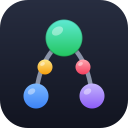
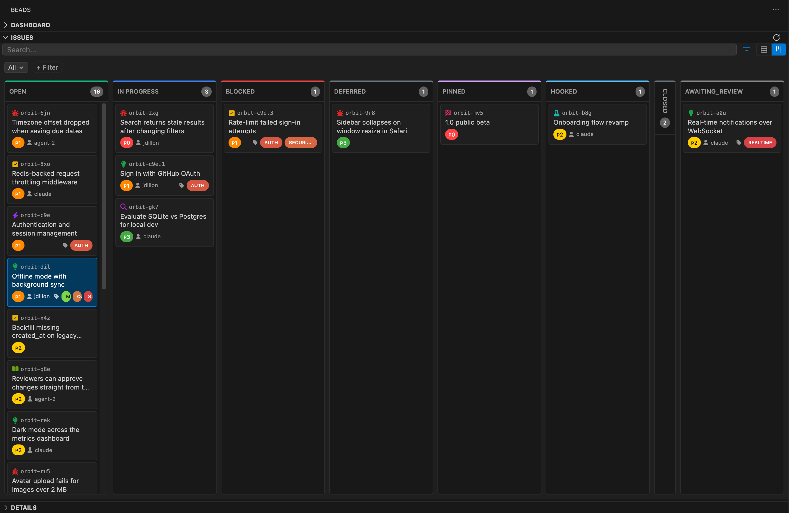

<div align="center">



# Beads UI

**Mission control for [Beads](https://github.com/gastownhall/beads) — the issue tracker built for AI coding agents.**

[](https://github.com/connorbell133/vscode-beads/actions/workflows/ci.yml)
[](LICENSE)

[Install](#install) · [Why](#why) · [Features](#features) · [Quick start](#quick-start) · [Beads CLI ↗](https://github.com/gastownhall/beads)


</div>

---

## Why

Your agents file issues, chain dependencies, and close out work in `bd` faster than you can read `bd list`. Beads stores the plan as a **dependency graph** — but a graph in a terminal is a wall of text.

Beads UI puts that graph on screen, live, inside VS Code:

- **See the whole DAG** — every bead, every blocker, every epic, drawn as the graph it actually is
- **Know what's ready** — the unblocked frontier, ranked by how much each pick-up unblocks
- **Steer, don't scroll** — change status, priority, and dependencies in place while your agents keep working
- **Watch it move** — Dolt-backed change polling keeps every view current as work lands

If you run coding agents on Beads, this is the window you've been missing.

## Features

### 🕸️ Dependency graph

The headline act. The full DAG in an editor tab, with **lenses** for scoping: the subtree converging on one epic, the ready frontier, or a bead's blast radius. Ready work glows, blocked chains trace on hover, cycles land in the Problems panel, and every epic gets a critical path. Scales past 150 nodes with density auto-collapse, find-in-graph, and edge-following keyboard traversal.

### 📋 Issues, Linear-style

Rows built from beads-native parts — priority glyph, bead id, status ring, type icon, title, and blocked-by/blocking chips straight from the graph — grouped under their epics with sticky headers and inline epic progress rings. Status and priority edit in place from the row. Search, presets, and filters that stay out of the way.

### 🗂️ Kanban board

Drag cards between columns to change status. Handles `deferred`, `pinned`, `hooked`, and custom statuses; collapsible columns; filter-aware counts; cards carry type, priority, assignee, and labels.

### 🎯 Ready lane

The dashboard answers one question first: *what can be picked up right now, and what does picking it up unblock?* Ordered by leverage, with blocker chains shown inline — derived from the graph, not from status labels.

### ✏️ Details panel

Full read/edit for any bead — title, description, design notes, status, priority, type, labels, assignee — with markdown rendering, colored inline dropdowns, and dependency management grouped by relationship type.

### 🔀 Multi-project & Dolt-aware

Auto-detects every `.beads` directory in your workspace. Projects on a Dolt SQL server are read directly over SQL for a fast UI; embedded-Dolt projects go through the `bd` CLI. Start/stop/inspect Dolt from the dashboard.

<div align="center">

</div>

## Install

Search **"Beads UI"** in VS Code / Cursor / VSCodium extensions, or:

- [VS Code Marketplace](https://marketplace.visualstudio.com/items?itemName=connorbell133.beads-ui)
- [Open VSX](https://open-vsx.org/extension/connorbell133/beads-ui)

**Requirements:** VS Code 1.85+, [`bd` CLI](https://github.com/gastownhall/beads) 1.0.5+ in PATH.

## Quick start

```bash
bd init          # in your project root, if you haven't already
```

1. Click the Beads icon in the Activity Bar
2. Hit `⌘⌥G` — meet your dependency graph
3. Hit `⌘⌥R` — see what's ready to work

| Keys | Action |
| --- | --- |
| `⌘⌥G` / `Ctrl+Alt+G` | Open dependency graph |
| `⌘⌥R` / `Ctrl+Alt+R` | Show ready work |
| `⌘⌥F` / `Ctrl+Alt+F` | Find in graph |

All commands are in the palette under `Beads:`, settings under `beads.*`. Full command/settings reference and troubleshooting: [docs/user-guide.md](docs/user-guide.md).

## How it works

One extension host process spawns `bd` for discovery and lifecycle, reads Dolt directly over SQL when a server is available, and streams typed messages to a single React webview bundle that renders every surface — dashboard, issues, board, graph, details. No files in `.beads/` are ever touched directly.

## Contributing

PRs welcome. Start with [docs/development.md](docs/development.md) — `bun install`, `bun run watch`, `F5`. This repo tracks its own work in Beads (`bd ready` to see open work), which makes it a decent playground for the extension itself.

---

<div align="center">

**If Beads UI helps you see what your agents are up to, [a star](https://github.com/connorbell133/vscode-beads/stargazers) helps others find it. ⭐**

Built with ❤️ and [Claude Code](https://claude.ai/code) · Originally forked from [jdillon/vscode-beads](https://github.com/jdillon/vscode-beads) (Apache 2.0), since substantially rewritten

Issue type icons from [Font Awesome Free](https://fontawesome.com) ([CC BY 4.0](https://creativecommons.org/licenses/by/4.0/)) · Licensed [Apache 2.0](LICENSE)

</div>
