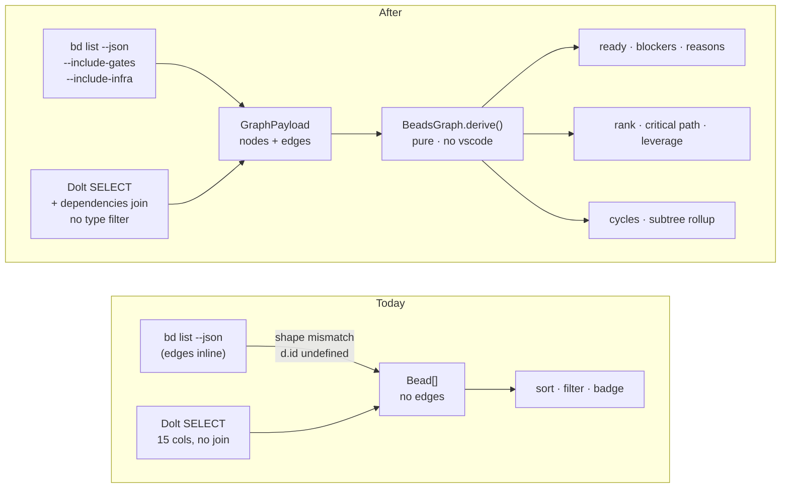
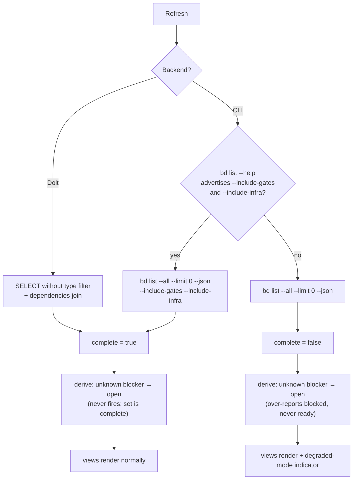
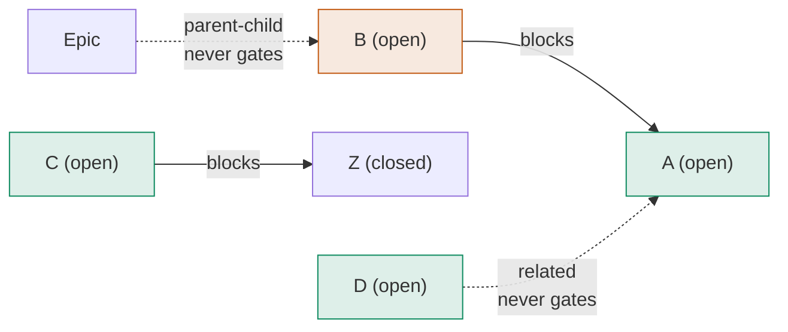
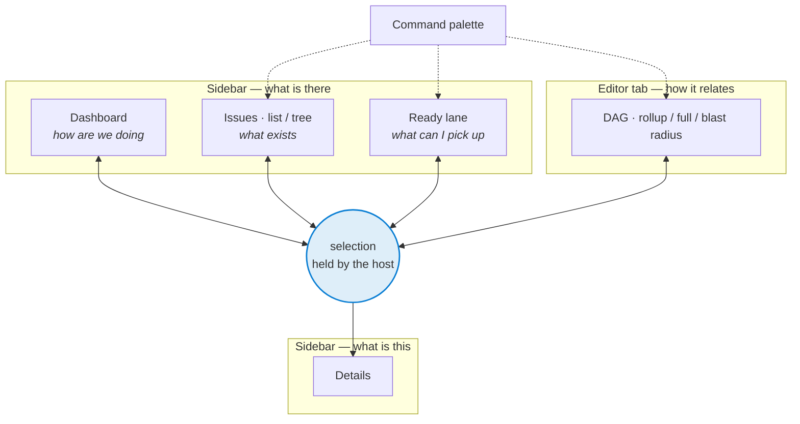

# refactor: Graph-native Beads — load the edges, derive the graph, build on it

## Summary

The extension loads beads without edges, so every view can only sort and filter what beads is
already a graph of. This plan closes that gap: one complete read per refresh, one pure derivation
module over it, and one message field carrying the result to the webview. It then rebuilds the
design foundation — theme-derived color, a focus and keyboard model, a motion budget — before
adding surfaces to it, because the current palette fails WCAG AA at the sizes it renders and the
webview has no accessibility floor to extend. On that base it builds the ready lane, the DAG in an
editor tab, a graph-derived tree, cycle diagnostics, leverage scoring, and critical path. Later
tiers (IDE-native, agent-aware, Dolt-native) are sequenced at the end as a roadmap, not specified
as units.

---

## Problem Frame

`bd list --json` ships each bead's dependency edges inline. The extension discards them on both
backends, for different reasons:

- The Dolt backend's `list()` selects 15 columns and never joins `dependencies`
  (`src/backend/BeadsDoltBackend.ts:122`). Edges load only per-issue on the `show()` path.
- The CLI backend passes the payload straight through, but the shape it expects — `{id,
  dependency_type}`, what `bd show` returns — is not the shape `bd list` emits — `{issue_id,
  depends_on_id, type}`. `issueToWebviewBead` reads `d.id` and gets `undefined`
  (`src/backend/types.ts:421`). Verified against bd 1.2.1 on a live database.

Everything downstream inherits the starvation. `readyCount: byStatus.open` counts a status label,
not readiness (`src/providers/DashboardViewProvider.ts:87`) — in beads, *ready* means open **and**
free of open blockers, which is the entire purpose of the `blocks` edge. `blockedCount` has the
same flaw. "View in graph" calls `beadsGraph.focus`, and no such view is registered in
`package.json` — the button does nothing. `DependencyGraph`, the `setGraph` message, and
`normalizeBead` are all declared and never used.

The load-time type filter compounds it. `HIDDEN_LIST_TYPES` drops `gate`, `agent`, `role`, and
`message` — correct parity with `bd list`'s default, but it removes nodes whose edges still arrive
attached to visible beads. A graph built from today's payload has edges pointing at nodes that
aren't in it.

---

## Requirements

### Graph fidelity

R1. A single list read per refresh returns every bead in the project — including `gate`, `agent`,
`role`, `message`, and `molecule` types — together with every dependency edge among them.

R2. Both backends emit edges in one normalized shape; no consumer can tell which backend produced
them.

R3. Reverse edges (what a bead blocks) are derived by inverting the forward edge set, not fetched
by a second query.

R4. Hidden bead types are filtered where they are displayed, never where they are loaded.

### Derivation

R5. A bead is ready when it is open and has no open `blocks` blocker.

R6. Only `blocks` edges gate readiness. `parent-child`, `related`, and `discovered-from` never do.

R7. A blocker absent from the loaded node set counts as open.

R8. The derivation module imports nothing from `vscode` and is covered by unit tests.

R9. The graph is derived on every read and never persisted.

R10. Dashboard `readyCount` and `blockedCount` report graph-derived values.

### Surfaces

R11. A webview panel host opens any view as an editor tab.

R12. "View in graph" opens the DAG panel focused on the originating bead.

R13. A ready lane shows what can be picked up now; blocked rows show their blocker chain inline.

R14. The DAG renders blocker→blocked left-to-right, with epic-rollup, full-graph, and blast-radius
lenses.

R15. The tree view is graph-derived, carries an orphans lane for parentless work, and shows
child-completion rollup on epic rows.

R16. Dependency cycles surface as VS Code diagnostics rather than an infinitely-expanding tree.

R17. Each ready bead reports how many beads its closure unblocks; each epic reports its longest
blocker chain.

### Compatibility and parity

R18. The extension detects whether the installed bd supports the completeness flags and degrades to
a documented conservative mode when it does not.

R19. Graph features produce identical results on the CLI and Dolt backends for the same data.

R20. No code path sends a flag to bd that the detected version rejects.

### Design and accessibility

R21. Every color is derived from a VS Code theme token. No hardcoded hex values remain in the
webview.

R22. Text meets WCAG AA contrast at the size it renders — 4.5:1 below 18px — in light, dark, and
high-contrast themes.

R23. No state is communicated by color alone. Status, type, and priority each carry a shape, icon,
or text label alongside their hue.

R24. Every interactive element has a visible focus state derived from `--vscode-focusBorder`.

R25. The ready lane, tree, and DAG are fully operable from the keyboard, including traversal from a
bead to its blockers.

R26. The DAG has a text equivalent that conveys the same relationships to a screen reader.

R27. Motion respects `prefers-reduced-motion`; every animation has a non-animated fallback that
preserves meaning.

R28. Every new surface defines its empty, loading, error, degraded, and truncated states.

R29. Selecting a bead on any surface reflects that selection on every other open surface.

R30. Spacing, radius, and type sizes come from the token scale rather than literals.

---

## Design Language

**Visual thesis.** The extension should read as though VS Code shipped it — inheriting the editor's
own type, spacing, and chart palette — with exactly one idea of its own: a dependency edge is a
visible object everywhere it exists, not a badge that summarizes one away.

That thesis is why the design work precedes the surfaces. The current webview communicates
relationships through a red "blocked" pill; the point of this refactor is that the relationship
itself becomes the interface.

**Mode.** Partial system. Tokens exist (`--spacing-xs`…`--spacing-xl`, `--border-radius`,
`--badge-*`, `--transition-fast|normal`) but are widely bypassed — 2,833 lines of CSS lean on
literals, with 6px, 10px, 3px, and 11px all off any consistent grid. VS Code's theme variables are
non-negotiable and already well used (42 distinct `--vscode-*` tokens). The plan follows what
exists and fills the gaps rather than importing a new system.

**Color strategy.** Hues come from `--vscode-charts-*`, which VS Code defines per theme and adapts
for high contrast. Six chart hues cannot uniquely encode fourteen bead types, and they should not
try — type is already carried by an icon (`TypeIcon`), so hue groups types into families while the
icon disambiguates. Status keeps a dedicated small set because status is the highest-frequency
scan target. Priority stops being a colored pill and becomes a weight-and-numeral treatment, which
removes four of the five failing contrast pairs outright.

**Density and type.** Inherit `--vscode-font-size` and `--vscode-font-family` rather than setting
sizes; the user already chose their editor density. Badge text stops at a fixed 10px and scales
relative to the editor's base, which is what lifts it out of the sub-18px contrast trap on the
pairs that remain colored.

**Motion budget — three, all tied to the graph:**
1. *Blocker-chain reveal* — expanding a blocked row slides its chain in at 150ms ease-out, staggered
   ~40ms per hop, so chain depth is felt as well as read.
2. *Lens transition* — switching DAG lens interpolates node positions over 250ms rather than
   re-rendering, so the epic rollup visibly expands into the full graph instead of becoming a
   different picture.
3. *Readiness settle* — when a blocker closes, the newly-ready bead animates from the blocked group
   to the ready group instead of appearing there after a refresh.

Each falls back to an instant state change under `prefers-reduced-motion`. Nothing else animates.

**Copy voice.** Orientation, status, and action — never promise or mood. "Blocked on bd-a1b2 and 2
more", not "Unlock your workflow". If a heading could appear on a marketing page, rewrite it. Empty
states teach the next action rather than apologizing.

---

## Key Technical Decisions

**One complete read, filtered at display.** Load with `--include-gates --include-infra` on the CLI
path and drop the `issue_type NOT IN (...)` predicate on the Dolt path, then filter hidden types in
the view layer. Readiness derived over a partial node set is wrong, not approximate: reproduced
against bd 1.2.1, a gate blocking bead A makes `bd ready` return empty while a graph built from
today's payload calls A ready. anton hit the same wall and documents the same rule — `src/lib/board.ts`
keeps the unfiltered list "or a `blocks` edge to an already-closed `molecule` would surface as a
phantom open blocker."

**Only `blocks` gates readiness.** `docs/reference/beads-dependency-model.md` states it and
anton's `computeEpicGraph` enforces it (`src/lib/epic-graph.ts:77`). Pin the rule once in the
derivation module so no view re-decides it.

**Edge direction is `from` = the blocked side, `to` = the blocker.** This matches
`bd dep add <from_id> <to_id>`, the repo's own dependency-model reference, and anton's convention.
The direction has been a recurring source of confusion; the module names it once and every consumer
inherits it.

**Reverse edges by inversion.** `bd list` emits only forward `dependencies` plus a
`dependent_count`. Because R1 makes the node set complete, inverting the forward set yields the
dependents exactly. No `--include-dependents` on the list path.

**Missing blocker counts as open.** When an edge points at a node not in the payload, treat the
blocker as unresolved. This is the fail-safe direction — it can over-report blocked, never
under-report it — and it is what makes the degraded mode of R18 safe.

**Feature-detect by parsing `bd list --help`, once per backend.** bd rejects unknown flags outright,
so one bad flag takes down the whole list. Reading the help text is deterministic and needs no
error-string classification, unlike probing the real command and interpreting the failure. Cache the
result alongside `checkCompatibility()`. Version-comparison was rejected: the release that
introduced `--include-gates` is not known, and guessing a floor risks locking out working builds.

**The graph carries a `complete` flag.** When the CLI path cannot pass the include flags, the node
set is partial while the Dolt path's is not. Rather than let the two backends diverge silently,
the derived model reports its own completeness and views surface a degraded-mode indicator. Honest
divergence beats mode-dependent results that look authoritative.

**Derive on every read; store never.** anton's rule from `DESIGN.md` §3 — the board is never a cache
to reconcile. The graph is recomputed from the list payload each refresh and thrown away.

**dagre for layout, plain SVG for rendering.** Port the shape of anton's `layoutGraphNodes`
(`src/components/epic/graph-layout.ts`) — it was written free of React and XYFlow types for exactly
this reuse, and takes `@dagrejs/dagre` as its only dependency. anton pairs it with `@xyflow/react`;
this plan does not. XYFlow would add a large dependency to an IIFE webview bundle for pan/zoom the
DAG can get from an SVG viewBox transform. Revisit if interaction demands outgrow that.

**The derivation module lives in `src/graph/`, not in a provider.** The summary being computed inline
in `DashboardViewProvider` is how the `readyCount` bug happened. One module with tests, consumed by
every view, so a new derived field is added in one place.

**Color derives from theme tokens, not a copied palette.** The current maps in
`src/webview/types.ts` are bd's *dark* TUI variants used against every theme. Measured against a
white editor background, `pinned` and `hooked` land at 1.98:1 and `open` at 2.54:1, and six of
fourteen type badges fall below AA at the 10–13px they render at. `--vscode-charts-*` is theme-
supplied and high-contrast-aware, so it fixes light themes and HC in one move. The alternative —
keeping the hues and hand-tuning a second light-theme palette — was rejected: it doubles the
surface to maintain and still ignores user-authored and high-contrast themes.

**Priority stops being a colored badge.** Four of five priority pills fail AA. Priority is ordinal,
not categorical, so hue was the wrong encoding to begin with; rank reads better as a numeral with
weight and a single alert hue reserved for P0. This deletes the failures rather than re-tuning them.

**One selection, many surfaces.** Selection state lives in the extension and is broadcast, not held
per webview. With list, tree, DAG, ready lane, dashboard, and details all live at once, per-surface
selection would leave a user hunting for the same bead six times. This is the uniform-connectedness
principle applied across panels, and it is what makes the DAG feel like a lens on the list rather
than a separate app.

**The DAG opens on the epic rollup, never the full graph.** A 500-node hairball on open is a
decision-paralysis surface with no entry point. Rollup first, expand on demand — progressive
disclosure, and it also keeps first paint inside the 400ms flow threshold on large projects.

**No minimap.** VS Code already trains users on the editor minimap, so the affordance is tempting,
but a minimap of a dagre layout is a second thing to keep legible and adds a fixed cost to every
render. Find-in-graph plus fit-to-selection covers the same job — locating yourself — with less
surface. Revisit if user testing says otherwise.

---

## High-Level Technical Design

### The read path, before and after

Today each backend arrives at zero edges by a different route. The refactor converges them on one
normalized payload before anything derives from it.



### Where completeness is decided

The include flags are the only place the two backends can diverge. This is the branch that decides
whether the derived graph claims completeness.



### Readiness semantics

The direction convention and the blocks-only rule, stated once. `A` is ready; `B` is not, because
`A` is open. Neither `related` nor `parent-child` participates.



Read every edge as *"the source is blocked by the target."* `B → A` means B waits on A. A blocker
stops counting once it is closed, which is why `C` is ready despite having an edge.

### Surface map

Phase 1 takes the extension from three surfaces to six. Each answers one question, and every surface
has exactly one route to the graph and one to details — not cross-links on every row.



Selection is the shared spine (U15). Without it, six surfaces means six places to lose a bead.

---

## Implementation Units

### Phase 0 — Foundation

Phase 0 alone fixes two user-visible bugs (the dashboard counts, the dead graph button) and is the
precondition for every unit after it.

### U1. Normalize the edge contract

**Goal:** One edge type that both backends produce and every consumer reads, replacing the silent
`bd list` / `bd show` shape mismatch.

**Requirements:** R2, R3

**Dependencies:** none

**Files:**
- `src/backend/BeadsBackend.ts` — add the normalized edge type and a `listGraph()` return shape
- `src/backend/types.ts` — accept both wire shapes when normalizing
- `src/backend/__tests__/types.test.ts` — extend

**Approach:** Add a `BeadEdge { from: string; to: string; type: DependencyType | string }` where
`from` is the blocked side and `to` is the blocker, matching `bd dep add` argument order. Teach the
normalizer to read `{issue_id, depends_on_id, type}` (what `bd list` emits) and `{id,
dependency_type}` (what `bd show` emits) into that one type. Keep `BeadDependency` for the details
panel's hydrated per-bead view — it carries title, status, and priority that the bulk edge set does
not.

**Patterns to follow:** anton's `beads.edgesOf` (`src/lib/beads/bd.ts:476`) — it walks each bead's
inline `dependencies` and skips entries missing any of the three fields rather than emitting
partial edges.

**Test scenarios:**
- A `bd list`-shaped dependency `{issue_id: "a", depends_on_id: "b", type: "blocks"}` normalizes to
  `{from: "a", to: "b", type: "blocks"}`.
- A `bd show`-shaped dependency `{id: "b", dependency_type: "blocks"}` on bead `a` normalizes to the
  same edge.
- A dependency missing `depends_on_id` is dropped, and the remaining edges on that bead still
  normalize.
- An unrecognized `type` value passes through verbatim rather than being coerced or dropped — bd
  allows custom edge types the same way it allows custom statuses.
- `issueToWebviewBead` still populates `dependsOn` and `blocks` for a `bd show` payload with full
  dependency metadata, unchanged from today.

**Verification:** `bun run test` passes; `bun run typecheck` clean; no consumer reads
`dependency_type` off a list payload.

### U2. Complete read on the CLI backend

**Goal:** `bd list` returns every bead and every edge, with graceful degradation on builds that
lack the completeness flags.

**Requirements:** R1, R18, R20

**Dependencies:** U1

**Files:**
- `src/backend/BeadsCommandRunner.ts` — capability probe, list args, `listGraph()`
- `src/backend/BeadsBackend.ts` — extend the interface
- `src/backend/__tests__/BeadsCommandRunner.test.ts`

**Approach:** `createListCommandArgs()` becomes a function of detected capability. Probe once by
running `bd list --help` and testing the output for `--include-gates` and `--include-infra`; cache
the result next to the existing `compatibilityPromise` so it costs one invocation per backend
lifetime. When both flags are present, append them. When either is absent, omit both and mark the
payload incomplete. Return `{ nodes, edges, complete }` rather than a bare array; edges come from
walking each issue's inline `dependencies`.

The existing 750ms `runReadJson` cache and in-flight coalescing already cover the list path — the
larger payload does not change the call frequency.

**Patterns to follow:** the existing `checkCompatibility()` / `compatibilityPromise` memoization in
the same file is the model for a once-per-backend probe.

**Test scenarios:**
- Help output containing both flag names produces list args including `--include-gates` and
  `--include-infra`, alongside the existing `--all --limit 0 --json`.
- Help output containing neither produces the args unchanged from today, and the returned payload
  reports `complete: false`.
- Help output containing only `--include-gates` omits both flags — a partial flag set is treated as
  unsupported rather than sending one and hoping.
- The probe runs once across repeated `listGraph()` calls.
- A probe that throws does not fail the list; it degrades to the no-flag args and `complete: false`.
- A list payload where one bead carries two `dependencies` entries and another carries none yields
  exactly two edges.

**Verification:** against a real project with a gate bead blocking a task, `listGraph()` returns the
gate in `nodes` and the gate edge in `edges`, and `complete` is true on bd 1.2.1.

### U3. Complete read on the Dolt backend

**Goal:** Backend parity — the SQL path returns the same nodes and edges as the CLI path.

**Requirements:** R1, R2, R19

**Dependencies:** U1

**Files:**
- `src/backend/BeadsDoltBackend.ts` — drop the load-time type filter, add a bulk dependency query,
  extract the row mappers as pure functions
- `src/backend/__tests__/BeadsDoltBackend.mapping.test.ts` — new

**Approach:** Remove `AND issue_type NOT IN (...)` from `list()`; the hidden-type filter moves to
display (U5). Add one bulk query over the dependencies table for the loaded id set, mirroring how
`loadLabels(ids)` already batches. Return `{ nodes, edges, complete: true }` — the SQL path has no
flag-availability problem, so it is always complete.

The backend needs a live Dolt server, so extract the SQL-row → `BeadsIssue` mapping and the
dependency-row → `BeadEdge` grouping into exported pure functions and test those. The query
execution itself stays covered by manual verification.

**Patterns to follow:** `loadLabels(ids)` in the same file — batched by id set, returned as a Map,
consumed during row mapping. `coalesceRead` already dedupes concurrent list calls.

**Test scenarios:**
- A dependency row set spanning three issues groups into per-issue edge lists keyed correctly, with
  `from` the dependent issue and `to` the blocker.
- An issue with no dependency rows maps to an empty edge list, not `undefined`.
- A dependency row referencing an id outside the loaded node set still produces an edge — the
  derivation layer, not the backend, decides what to do with a dangling target.
- Row mapping preserves the existing `NULLIF(assignee, '')` and timestamp normalization behavior.
- A `gate`-typed row survives mapping rather than being filtered.

**Verification:** on a project with mixed types and cross-type edges, the Dolt and CLI paths return
node sets and edge sets that compare equal after sorting by id.

### U4. The BeadsGraph derivation module

**Goal:** One pure module that turns nodes plus edges into readiness, blocker chains, rank, cycles,
leverage, and subtree rollups.

**Requirements:** R5, R6, R7, R8, R9, R17

**Dependencies:** U1

**Files:**
- `src/graph/BeadsGraph.ts` — new
- `src/graph/types.ts` — new
- `src/graph/__tests__/BeadsGraph.test.ts` — new

**Execution note:** Implement test-first. Every downstream unit reads this module's output, and its
correctness rules (blocks-only, direction, fail-safe on unknown) are exactly the kind that a later
UI change can silently violate.

**Approach:** A single `deriveGraph(nodes, edges, { complete })` returning a model keyed by bead id.
Per bead: `blockedBy` (open blockers only), `ready`, `rank`, `leverage`, `blockerChain`, plus
epic-level `childCounts`. Graph-level: `cycles`, `hasCycle`, `complete`, `orphans`.

Topological rank via Kahn's longest-path, where a blocker precedes what it blocks. On a cycle,
degrade to a stable priority-then-created-then-id ordering and flag the tangled edges rather than
throwing — a cycle is a data condition to report (U11), not a crash.

Leverage is the size of the transitive set a bead's closure would unblock, memoized across the DAG
walk so it stays linear in edges. Critical path per epic is the longest `blocks` chain among its
members.

**Technical design** — directional, not a specification:

```
deriveGraph(nodes, edges, opts) -> BeadsGraphModel
  byId        = Map<id, node>
  blockEdges  = edges.filter(e => e.type === "blocks")
  isOpen(id)  = byId.has(id) ? byId.get(id).status !== "closed"
                             : true            // R7: unknown blocker counts as open
  blockedBy   = for each blockEdge e: if isOpen(e.to) then push e.to onto blockedBy[e.from]
  ready       = node.status is open-ish AND blockedBy[node.id] is empty
  rank        = kahn(longest path, blocker before blocked)
                on cycle -> flag tangled edges, fall back to (priority, createdAt, id)
  leverage    = |transitive successors over blockEdges|, memoized
  children    = parent scalar when present, else parent-child edges
  orphans     = nodes with no parent and no parent-child edge
```

**Patterns to follow:** anton's `computeEpicGraph` (`src/lib/epic-graph.ts` in the anton repo) for
the Kahn implementation, the cycle-degrade behavior, and the "blocker counts only while it isn't
done" rule. Its `standaloneBlockers` documents the fail-safe-on-unknown rule adopted here as R7.
Note that anton rolls everything up to epic level for its board; this module keeps bead-level
resolution and offers the epic rollup as one lens.

**Test scenarios:**
- A open, B open with `B → A` blocks: A is ready, B is not, and B's `blockedBy` is `["A"]`.
- The same graph with A closed: both are ready and B's `blockedBy` is empty.
- `parent-child`, `related`, and `discovered-from` edges never populate `blockedBy` and never affect
  `ready`.
- An edge whose target is absent from `nodes` leaves the source not-ready with the unknown id in
  `blockedBy` — the fail-safe direction.
- A three-bead cycle A→B→C→A: `hasCycle` is true, the three edges are flagged in-cycle, every node
  still receives a finite rank, and derivation returns rather than throwing or looping.
- A chain of four sequential blockers yields ranks 0, 1, 2, 3 and a critical path of length 4 for the
  epic containing them.
- Diamond A→B, A→C, B→D, C→D: D's rank is 2, not 1 — longest path, not shortest.
- Leverage for a bead blocking two beads that each block one more is 4, counting transitively and
  without double-counting a shared descendant.
- An epic with three children, one closed, reports `1/3` rollup.
- A parentless task with no `parent-child` edge appears in `orphans`; an epic child does not.
- `complete: false` propagates to the model without changing any other derived value.
- Deriving twice over the same input returns equal models — no hidden state.
- A 2,000-node graph with 5,000 edges derives without stack overflow (iterative traversal, not
  recursive).

**Verification:** `bun run test` passes; the module has no `vscode` import; `deriveGraph` is a pure
function of its arguments.

### U5. Ship the graph to the views

**Goal:** Providers post the derived graph beside the beads, the dashboard counts become
graph-derived, and hidden types are filtered at display.

**Requirements:** R4, R10, R19

**Dependencies:** U2, U3, U4

**Files:**
- `src/backend/types.ts` — add `setGraph` payload with the real model; add the hidden-type constant
- `src/webview/types.ts` — mirror the message and model types
- `src/providers/BaseViewProvider.ts` — one shared load-and-derive helper
- `src/providers/DashboardViewProvider.ts` — replace the inline summary computation
- `src/providers/BeadsPanelViewProvider.ts` — post the graph alongside beads
- `src/webview/App.tsx` — hold the graph in app state
- `src/webview/views/IssuesView.tsx` — filter hidden types for display
- `src/webview/views/DashboardView.tsx` — render the degraded-mode indicator
- `src/providers/__tests__/dashboard-summary.test.ts` — new

**Approach:** Move the summary computation out of `DashboardViewProvider.loadData` into a small
derived-summary function that takes the graph model, so `readyCount` and `blockedCount` come from
`ready` and `blockedBy` rather than `byStatus.open` and `byStatus.blocked`. Both providers call one
shared load-and-derive path on `BaseViewProvider` so the CLI and Dolt backends cannot drift.

Hidden-type filtering moves to the webview. `HIDDEN_LIST_TYPES` becomes a display-layer constant
consumed by the Issues list and the Kanban board; the graph keeps every node. Without this half, the
U2/U3 load change would leak gate and agent beads into the Issues list.

When `complete` is false, the dashboard shows a one-line notice naming the flags and the fix
(upgrade bd), because in that mode blocked counts can over-report.

**Test scenarios:**
- A graph with three open beads where one is blocked reports `readyCount: 2`, `blockedCount: 1`,
  regardless of any bead carrying the literal `blocked` status.
- A bead whose status is literally `blocked` but which has no open blocker counts as ready — the
  status label does not override the graph.
- `byStatus` still counts raw statuses including custom ones, unchanged from today.
- A summary derived from an empty project returns all-zero counts with the built-in statuses seeded,
  matching today's no-project behavior.
- A graph containing a `gate` node produces a bead list for the Issues view that excludes it, while
  the graph passed alongside still contains it.
- `complete: false` sets the degraded flag on the posted summary.

**Verification:** on a project with a real blocker chain, the dashboard's ready count matches
`bd ready --json | jq length` and the blocked count matches `bd blocked --json | jq length`.

### U6. Editor-tab panel host

**Goal:** Any view can open as an editor tab, not only as a 300px sidebar view.

**Requirements:** R11

**Dependencies:** U5

**Files:**
- `src/providers/BeadsWebviewHost.ts` — new, the host-agnostic base
- `src/providers/BeadsPanelHost.ts` — new, the `WebviewPanel` host
- `src/providers/BaseViewProvider.ts` — reduce to the `WebviewViewProvider` specifics
- `src/extension.ts` — register the panel command
- `package.json` — contribute `beads.openGraph`
- `src/webview/App.tsx` — route the new view types

**Approach:** `BaseViewProvider` currently mixes three concerns: HTML generation, message plumbing
and the shared message switch, and the `WebviewViewProvider` lifecycle. Extract the first two into
`BeadsWebviewHost`, which owns `getHtmlForWebview`, `postMessage`, `handleMessage`, `setLoading`,
`setError`, and the abstract `loadData` contract. `BaseViewProvider` keeps `resolveWebviewView` and
visibility-driven refresh; `BeadsPanelHost` owns `createWebviewPanel`, column targeting,
`onDidDispose`, and single-instance reveal.

This is a refactor with no behavior change in the sidebar views. Land it as its own commit so a
regression in the sidebar is bisectable away from the DAG work.

**Execution note:** Add characterization coverage for the existing sidebar message-handling path
before moving it — `no-project-loading-state.test.ts` is the only provider test today, and the
message switch has no coverage at all.

**Test scenarios:**
- Every message case the sidebar handles today (`ready`, `refresh`, `selectProject`, `selectBead`,
  `openBeadDetails`, `copyBeadId`, `openFile`, the four Dolt cases) routes identically after the
  extraction.
- Opening the panel twice reveals the existing panel rather than creating a second one.
- Disposing the panel clears its reference so a later open creates a fresh one.
- A panel that receives `postMessage` after disposal does not throw.
- The sidebar providers still post `setViewType` matching their registered view id.

**Verification:** sidebar Dashboard, Issues, and Details behave identically before and after; a
command opens an empty panel in an editor tab and it survives a window reload.

### U7. Retire the dead graph stubs

**Goal:** Remove the placeholders that make the codebase look like it has a graph, and make "View
in graph" do what it says.

**Requirements:** R12

**Dependencies:** U6

**Files:**
- `src/backend/types.ts` — delete `normalizeBead` and the placeholder `DependencyGraph`
- `src/providers/BaseViewProvider.ts` — route `viewInGraph` to the panel
- `src/providers/BeadDetailsViewProvider.ts` — same
- `src/webview/types.ts` — keep the `viewInGraph` message, drop the unused graph placeholder

**Approach:** `normalizeBead` is exported and never called anywhere in `src/` — and it maps
`depends_on` as a bare id array, a third shape that matches neither backend. Delete it rather than
fix it. The placeholder `DependencyGraph` interface and its `setGraph` message are replaced by the
real model from U5, so the old declarations go with them. `viewInGraph` stops calling the
nonexistent `beadsGraph.focus` and instead opens the DAG panel with the bead id as focus target.

**Test scenarios:**
- No test or source file references `normalizeBead` after removal, and the existing
  `types.test.ts` suite still passes.
- `viewInGraph` from the details panel opens the DAG panel and posts the originating bead id.
- `viewInGraph` with no panel host available logs rather than throwing.

**Verification:** `bun run lint` and `bun run typecheck` clean with no unused exports; the details
panel's graph button opens a real view.

### Phase 0.5 — Design foundation

U13 through U15 execute after Phase 0 and before Phase 1. Their U-IDs are higher because they were
added in a later revision; the phase order, not the numbering, is the sequence. They exist as their
own phase because four new surfaces built on today's foundation would multiply its defects by four —
and because none of them is worth doing per-surface.

### U13. Theme-derived color system

**Goal:** Replace the hardcoded palette with theme-derived tokens that hold contrast in light, dark,
and high-contrast themes.

**Requirements:** R21, R22, R23

**Dependencies:** none (parallel with Phase 0)

**Files:**
- `src/webview/theme/tokens.ts` — new, the semantic color layer
- `src/webview/theme/__tests__/contrast.test.ts` — new
- `src/webview/types.ts` — remove `STATUS_COLORS`, `TYPE_COLORS`, `PRIORITY_COLORS` and their text-color maps
- `src/webview/common/StatusBadge.tsx`, `TypeBadge.tsx`, `PriorityBadge.tsx`, `LabelBadge.tsx`
- `src/webview/utils/label-colors.ts`
- `src/webview/styles.css`

**Approach:** Map status, type, and priority onto a semantic layer resolved from `--vscode-charts-*`
plus the existing `--vscode-*` foreground and badge tokens. Type hue groups families — planning,
work, coordination — and `TypeIcon` disambiguates within a family, since six chart hues cannot
uniquely encode fourteen types and should not try. Status keeps its own small set because it is the
highest-frequency scan target. Priority becomes a numeral with weight rather than a filled pill,
which removes four failing pairs instead of re-tuning them; P0 keeps one alert hue.

Add a `@media (forced-colors: active)` block that surrenders decorative fills to system colors — the
one place where the right move is to stop styling.

Verify the exact `--vscode-charts-*` token names against the running editor before building on them;
the codebase already reaches for semantic tokens like `--vscode-testing-iconPassed`, so the pattern
is established but the chart set is unconfirmed here.

**Patterns to follow:** `src/webview/common/StatusPriorityPill.tsx` for badge composition; the
existing `--badge-*` token block in `styles.css` for the shape scale.

**Test scenarios:** Contrast is computable, so assert it rather than eyeballing it. The test module
takes a foreground/background pair and returns a WCAG ratio:
- Every status token pair meets 4.5:1 against both the light and dark editor background values.
- Every type token pair meets 4.5:1 at the rendered badge font size.
- The P0 alert pair meets 4.5:1; P1 through P4 assert no color dependency at all.
- Two different types in the same hue family resolve to different icons.
- A bead with an unknown custom type falls back to the neutral token and the `notdef` icon rather
  than an undefined color.
- No module under `src/webview/` exports a literal hex color — assert by scanning the built output.

**Verification:** the Issues list, Kanban board, and Details panel render legibly under the Default
Light Modern, Default Dark Modern, and Dark High Contrast themes; the 88 hardcoded hex values across
the seven webview files are gone.

### U14. Interaction primitives

**Goal:** One focus, keyboard, and motion foundation the four new surfaces inherit rather than each
reinventing.

**Requirements:** R24, R25, R27, R30

**Dependencies:** none (parallel with Phase 0)

**Files:**
- `src/webview/styles.css` — focus, motion, and token blocks
- `src/webview/hooks/useRovingFocus.ts` — new
- `src/webview/hooks/__tests__/useRovingFocus.test.ts` — new
- `src/webview/common/` — focus states on existing interactive components

**Approach:** Three primitives. A `:focus-visible` treatment built on `--vscode-focusBorder`,
applied through one selector list rather than per component — the webview has zero focus rules
today, so this is additive, not a migration. A roving-tabindex hook for any linear or tree-shaped
collection, so a list is one tab stop with arrow-key traversal inside it, matching how VS Code's own
trees behave. A `@media (prefers-reduced-motion: reduce)` block that collapses the three planned
motions to instant state changes.

Consolidate the off-grid literals (6px, 10px, 3px, 11px) onto the existing token scale as the files
are touched, rather than as a separate sweep — a mechanical repo-wide rewrite of 2,833 lines of CSS
carries more regression risk than value.

**Execution note:** Add the focus treatment first and verify it against the existing views before
the new surfaces exist. A focus ring that clips or collides is easier to find on three known views
than on seven.

**Test scenarios** (over `useRovingFocus`, which is pure state):
- Arrow-down from the last item wraps to the first; arrow-up from the first wraps to the last.
- Home and End jump to the first and last items.
- Exactly one item carries `tabIndex={0}` at any time; all others are `-1`.
- Removing the focused item moves focus to its neighbor rather than losing it to the document.
- An empty collection exposes no tab stop and does not throw.
- Typing a character jumps to the next item whose label starts with it, matching VS Code tree
  behavior.

**Verification:** every interactive element in the three existing views is reachable and visibly
focused by keyboard alone; the Kanban board's transitions are inert under the OS reduced-motion
setting.

### U15. Cross-surface selection and navigation

**Goal:** One selected bead, reflected everywhere, with a defined way to move between the six
surfaces.

**Requirements:** R29

**Dependencies:** U5, U6

**Files:**
- `src/backend/types.ts`, `src/webview/types.ts` — selection broadcast message
- `src/providers/BeadsWebviewHost.ts` — own and broadcast selection
- `src/extension.ts` — command palette entries
- `package.json` — commands and keybindings
- `src/webview/App.tsx` — consume selection

**Approach:** After Phase 1 the extension has six live surfaces: dashboard, issues list, tree mode,
ready lane, DAG tab, and details. Six surfaces each holding their own selection is six places to
lose your place. Selection moves to the extension host and broadcasts on change, so highlighting a
row highlights the corresponding DAG node and scrolls the tree to it.

Navigation gets one rule: the sidebar answers *what is there*, the editor tab answers *how it
relates*, and details answers *what is this*. Every surface offers exactly one way out to the graph
and one to details — not a menu of cross-links on every row, which is how this kind of UI degrades
into a link farm.

Command palette entries carry the accelerators, since that is where VS Code users already look:
show ready work, open the graph on the selected bead, find in graph, toggle tree mode.

**Test scenarios:**
- Selecting a bead in the issues list broadcasts once; the dashboard, tree, and DAG all report the
  same selected id.
- Selecting in the DAG broadcasts back and the list scrolls the row into view.
- Selection survives a panel being closed and reopened.
- Selecting a bead hidden by the current filter still broadcasts, and the receiving surface reports
  it as out-of-view rather than silently ignoring it.
- Clearing selection on project switch clears it on every surface.
- A surface that mounts after a selection was made receives the current selection on ready.

**Verification:** with all six surfaces open, selecting a bead anywhere highlights it in the other
five within one frame.

### Phase 1 — Graph-native

Each unit here is mostly UI work over a model that already exists. None is possible before Phase 0,
and each inherits the color, focus, and motion foundation from Phase 0.5 rather than defining its
own.

### U8. Ready lane

**Goal:** Make graph-derived readiness a first-class surface — what to pick up now, why it is
ready, and what it unblocks.

**Requirements:** R13, R17

**Dependencies:** U5

**Files:**
- `src/webview/views/ReadyLane.tsx` — new
- `src/webview/common/BlockerChain.tsx` — new
- `src/webview/views/DashboardView.tsx` — host the lane
- `src/webview/styles.css`

**Approach:** Two groups: ready beads sorted by leverage then priority, and blocked beads with their
blocker chain rendered inline as a breadcrumb of ids rather than a red badge. Each blocker in the
chain is clickable and opens that bead's details. Reuse `StatusBadge`, `PriorityBadge`, and
`TypeIcon` rather than introducing new row markup, per the components-over-ad-hoc-markup convention.

The lane is a list, not a card grid — a row is not a container for its own interaction, it *is* the
interaction, so card chrome would add weight without meaning. Grouping comes from a section header
and spacing rather than borders.

**Interaction states:**
- *Empty, nothing ready* — the honest and common case. Name what is blocking everything and offer
  the top blocker as the next action, rather than "No ready work" with no way forward.
- *Empty, no beads at all* — teach the entry point (`bd create`), matching the extension's existing
  no-project copy.
- *Loading* — skeleton rows at the row height, not a spinner; the lane's length is roughly
  predictable and layout shift on arrival is the thing to avoid.
- *Error* — inline in the lane with the failing operation named, not a toast that disappears.
- *Degraded* (`complete: false`) — a single line stating that blocked counts may over-report and
  why, placed above the blocked group where the imprecision actually lives.
- *Truncated* — chains beyond the display cap show the first hop, the last hop, and the hidden
  count; the cap is never silent.
- *Hover, focus, selected* — three distinguishable treatments. Selected must survive focus moving
  elsewhere, or cross-surface selection (U15) reads as broken.

**Test scenarios:** The presentation is React under a jest config that matches only `*.test.ts` in a
node environment, so the sortable and groupable logic is extracted into
`src/graph/readyLane.ts` and tested there:
- Ready beads sort by descending leverage, then ascending priority, then id.
- A bead blocked by two open blockers renders a chain of both, ordered by rank.
- A chain longer than a display cap truncates with the count of hidden blockers, and the first and
  last entries survive truncation.
- Closed beads appear in neither group.

**Verification:** on a project with a known blocker chain, the lane's ready set matches
`bd ready --json`.

### U9. DAG view in an editor tab

**Goal:** Render the dependency graph as a laid-out DAG, left-to-right, blocker→blocked.

**Requirements:** R14

**Dependencies:** U6, U4

**Files:**
- `package.json` — add `@dagrejs/dagre`
- `src/graph/layout.ts` — new, pure dagre mapping
- `src/graph/__tests__/layout.test.ts` — new
- `src/webview/views/GraphView.tsx` — new
- `src/providers/BeadsGraphPanel.ts` — new, a `BeadsPanelHost` subclass
- `src/extension.ts`, `package.json` — register the command

**Approach:** Port the shape of anton's `layoutGraphNodes` — nodes in, edges in, `Map<id, {x, y}>`
out, free of React types, edges to unknown nodes ignored rather than thrown, isolated nodes still
positioned. Render as SVG with a viewBox transform for pan and zoom; nodes are `<g>` elements
carrying the same status and type colors the list uses.

Three lenses over the same model: epic rollup (nodes are epics, ticket-level edges rolled up),
full graph (every non-hidden bead), and blast radius (the transitive closure around one bead).
The lens is a filter over nodes and edges applied before layout, so all three share one render path.
The DAG opens on epic rollup — never the full graph — so first paint is a readable dozen nodes with
an obvious way to go deeper.

Node visual language follows U13: status drives the fill, type drives the icon, and the edge itself
carries the meaning. A blocked edge is solid; `parent-child` is not drawn at all in the blocks
lenses, because drawing containment alongside blockage is what makes dependency graphs unreadable.

**Interaction states:** empty (no edges anywhere — say so and point at the list rather than
rendering an empty canvas), loading (lay out and fade in once rather than animating nodes into
place on first paint), error, degraded (the same `complete: false` notice, since a partial node set
means a partial graph), and a selected node treatment that matches the list's so U15's broadcast
reads as one selection.

**Accessibility:** the SVG carries a text equivalent — a `role="img"` label naming node and edge
counts, plus a visually-hidden adjacency list giving each bead and its blockers as real text. A DAG
that exists only as `<path>` elements is invisible to a screen reader, and this is the surface most
likely to fail review on a marketplace listing that claims design quality.

**Test scenarios** (over `src/graph/layout.ts`, which is pure):
- Every input node receives a position, including one with no edges.
- An edge referencing an id absent from the node list is skipped and does not throw.
- Positions are top-left corners, not centers — a node of width 100 at dagre center x=150 maps to
  x=100.
- `direction: "LR"` produces a layout whose x-spread exceeds its y-spread for a linear chain, and
  `"TB"` the reverse.
- Layout of a graph containing a cycle returns positions for every node rather than hanging.
- Two runs over the same input produce identical positions.
- The blast-radius lens over a bead with two upstream and three downstream beads yields six nodes,
  and excludes an unrelated component.

**Verification:** opening the DAG on a project with an epic and its children shows the epic-rollup
lens by default, and switching lenses re-lays out without a reload.

### U16. DAG legibility at scale

**Goal:** Keep the graph usable at the sizes real projects reach, where a laid-out DAG stops being a
picture and becomes a place you have to navigate.

**Requirements:** R14, R25, R26

**Dependencies:** U9

**Files:**
- `src/webview/views/GraphView.tsx` — viewport, focus mode, find
- `src/graph/layout.ts` — density thresholds
- `src/webview/common/GraphToolbar.tsx` — new

**Approach:** Four affordances, each answering a question the user has at a specific size.

*Where am I?* — fit-to-selection rather than a minimap. The selected bead from U15 is the anchor;
one action frames it and its immediate neighborhood. A minimap of a dagre layout is a second
rendering to keep legible for the same job.

*Where is bd-a1b2?* — find-in-graph, filtering as you type, matching id and title, with matches
highlighted in place and non-matches dimmed rather than removed. Removing them would re-run layout
and move everything, which destroys the spatial memory the user just built.

*Why is this a hairball?* — a density threshold. Above a node count the layout can't keep legible,
collapse to epic rollup and say so, with an explicit override. Silently rendering 500 overlapping
nodes is worse than declining to.

*What connects to what?* — hover on a node dims everything outside its blocker and blocked chains.
This is the single highest-value interaction in a dependency graph and it costs one CSS class.

Keyboard traversal follows the graph rather than the DOM: arrow keys move along edges from the
focused node to its blockers and blocked, which is the only navigation model that makes sense in a
DAG and is what makes R25 true here.

**Test scenarios** (over the pure filter and threshold logic in `src/graph/`):
- A find query matching two of twenty nodes marks exactly those two and dims eighteen, leaving all
  twenty positioned.
- A find query matching nothing reports no matches without clearing the graph.
- Find matches on id and on title, case-insensitively.
- A node count above the density threshold returns the rollup lens with an `autoCollapsed` reason;
  below it returns the requested lens.
- The override flag defeats the threshold.
- Neighbor traversal from a node with two blockers and three blocked returns five reachable
  neighbors in a stable order.
- Traversal from an isolated node returns no neighbors and does not move focus.

**Verification:** on a synthetic 500-node graph, the view opens on the rollup with the collapse
notice, find locates a bead by id, and hover isolates its chains without a re-layout.

### U10. Graph-derived tree view

**Goal:** Hierarchy from the graph, with an orphans lane and epic completion rollup.

**Requirements:** R15

**Dependencies:** U5

**Files:**
- `src/graph/tree.ts` — new
- `src/graph/__tests__/tree.test.ts` — new
- `src/webview/views/IssuesView.tsx` — view-mode toggle and expand column
- `src/webview/hooks/useColumnState.ts` — persist the mode

**Approach:** Build on the existing TanStack proposal, since removed with `sandbox/` and readable
via `git show 9790748:sandbox/tree-view-design-proposal.md` —
`getSubRows()` plus `getExpandedRowModel()`, list/tree toggle in the toolbar — with the tree shape
now coming from the graph rather than from per-bead `dependsOn` hydration. `bd list` emits both a
`parent` scalar and the `parent-child` edge, verified against bd 1.2.1; prefer the scalar and fall
back to the edge. Parentless work collects into an Orphans lane. Epic rows carry `7/12 · 58%`.

Rollup renders as a progress treatment rather than a bare fraction — an incomplete epic is what a
planner is scanning for, and a partially-filled bar is read faster than parsed text. The fraction
stays as the accessible label so it is not progress-by-color-alone.

**Interaction states:** expanded and collapsed persist per project across reloads, so tree mode is
not re-navigated every session. Filtering keeps a matched child's parent visible as dimmed context
rather than orphaning the match. The Orphans lane collapses by default and reports its count in its
header — on a healthy project it is empty, and on an unhealthy one it is the finding. Indentation
carries depth alongside the connector line, so depth survives high-contrast mode where the system
may redraw the line.

**Test scenarios** (over `src/graph/tree.ts`):
- Three tasks with `parent` set to the same epic nest under it.
- A task whose parent is present only as a `parent-child` edge still nests.
- A task whose `parent` names a bead absent from the node set lands in orphans rather than being
  dropped.
- A parent-child cycle terminates and reports the affected ids rather than recursing forever.
- An epic with 12 children of which 7 are closed reports `7/12`; an epic with no children reports no
  rollup rather than `0/0`.
- Filtering to a status that matches only a child keeps its parent visible as context.

**Verification:** toggling to tree mode on a project with epics shows the same bead count as list
mode, plus the orphans lane.

### U11. Cycle diagnostics

**Goal:** A dependency cycle reports itself instead of rendering as an infinitely-expanding tree.

**Requirements:** R16

**Dependencies:** U4

**Files:**
- `src/providers/BeadsDiagnostics.ts` — new
- `src/extension.ts` — register the diagnostic collection

**Approach:** The graph model already reports cycles (U4). Publish each as a diagnostic into a
`beads` collection. Beads are not files, so anchor each diagnostic on the `.beads` directory URI
with the cycle members named in the message. Refresh the collection on every derive; clear it when
the active project changes.

**Test scenarios:**
- A model with one three-bead cycle publishes one diagnostic naming all three ids.
- A model with two disjoint cycles publishes two diagnostics.
- A model with no cycles clears any previously published diagnostics.
- Switching projects clears the previous project's diagnostics before publishing the new ones.
- A cycle whose members include a hidden-type bead still reports, since the graph carries hidden
  types.

**Verification:** creating a deliberate `A → B → A` cycle in a scratch project surfaces it in the
Problems panel within one refresh interval, and removing the edge clears it.

### U12. Leverage and critical path

**Goal:** Surface the two derived planning facts the graph makes available.

**Requirements:** R17

**Dependencies:** U4, U8

**Files:**
- `src/webview/views/ReadyLane.tsx` — leverage column and sort
- `src/webview/views/DashboardView.tsx` — critical path per epic
- `src/webview/common/LeverageBadge.tsx` — new

**Approach:** The values come from `deriveGraph`; this unit is presentation. Leverage renders as
"unblocks N" on ready rows and becomes the lane's default sort. Critical path renders per epic as
its longest blocker chain depth, with the chain expandable.

**Test scenarios:** Computation is covered by U4's leverage and critical-path scenarios. This unit
adds:
- A bead with leverage 0 renders no badge rather than "unblocks 0".
- An epic whose members have no `blocks` edges among them reports a critical path of 1, its own
  depth.

**Verification:** the ready lane's default order puts the highest-leverage bead first, and an epic
with a nine-deep chain reports nine.

---

## Acceptance Examples

The design requirements are conditional by nature — most of them describe what happens in a state
the happy path never reaches. These pin the ones where prose leaves room to guess.

AE1. **Nothing is ready.** Every open bead has an open blocker. The ready lane does not render an
empty group; it names the blocker that gates the most work and offers it as the next action.

AE2. **A high-contrast theme is active.** Badges surrender their fills to system colors and remain
distinguishable by icon and label. No hue carries meaning that the icon does not also carry.

AE3. **The graph is incomplete.** `complete` is false. The blocked group carries one line stating
that its count may over-report and naming the cause. The ready group is unchanged, because the
fail-safe rule can only move beads out of ready, never into it.

AE4. **A blocker chain is nine hops deep.** The row shows the first hop, the last hop, and "+7
more". Expanding reveals the full chain; the count is never omitted.

AE5. **The project has 500 beads.** The DAG opens on epic rollup with a notice that the full graph
was collapsed, and an explicit control to render it anyway.

AE6. **A screen reader reaches the DAG.** It encounters a labelled image reporting node and edge
counts, followed by an adjacency list naming each bead and its blockers as text.

AE7. **The user has reduced motion enabled.** The blocker chain appears instantly, the lens switch
cuts rather than interpolates, and a newly-ready bead is simply in the ready group on next render.

AE8. **A bead is selected while the list filter excludes it.** The list reports the selection as
out of view with a control to clear the filter, rather than showing no selection at all.

AE9. **A bead carries a custom type bd does not define.** It renders with the neutral token and the
`notdef` icon. No color is undefined and no bead is dropped.

---

## Scope Boundaries

### In scope

Phases 0, 0.5, and 1 above, at implementation depth. The data foundation, the design foundation, and
the graph-native surfaces.

### Deferred to follow-up work

These are the artifact's remaining tiers. Each is real work with a sequence, not a non-goal — they
are deferred because specifying 29 proposals at once produces a document no one can review, and
because every one of them is cheaper after Phase 0 exists.

**Phase 2 — IDE-native.** Bead links, hovers, and CodeLens on `TODO(bd-xxx)` (`Markdown.tsx` already
posts `openFile`; nothing generates those links yet) · quick capture from a selection via `bd q` with
a `discovered-from` edge · SCM integration (commit-box picker, branch↔bead inference,
`--external-ref` for PR urls) · `lint`, `stale`, `doctor`, `preflight`, `orphans`, `find-duplicates`
as diagnostics · full-page bead editor. Note that `bd doctor` refuses to run in embedded mode —
verified on bd 1.2.1 — so the health unit must feature-detect per check.

**Phase 3 — Agent-aware.** Presence and lease labels · project memory panel (`remember` / `recall` /
`memories` / `prime`) · human inbox with an activity-bar badge · gates and merge slots given a lane ·
configurable namespaced label chips · approve/claim controls with anton's soft-lock semantics ·
Language Model Tools registration · anton bridge.

**Phase 4 — Dolt-native.** Time travel via `AS OF` · bead blame from `bd history` · branch diff ·
velocity and burndown · aging heat.

**Plumbing carried alongside.** Filesystem watcher on `.beads/` to replace the CLI path's fixed 3s
timer (`getChangeToken()` returns `null` there today), with polling backoff when the window is
unfocused · command palette keybindings for ready, capture, graph, and search.

### Out of scope

- Writing to beads from the graph surfaces. Every unit here reads; dependency editing stays in the
  details panel.
- Any cache or local mirror of bead state. The graph is derived per read and discarded.
- Adopting `@xyflow/react`. See the layout decision above.
- A mechanical rewrite of all 2,833 lines of `styles.css` onto the token scale. Off-grid literals
  get consolidated in the files each unit already touches; a repo-wide sweep carries more
  regression risk than value.
- A custom font. The extension inherits `--vscode-font-family` — a webview that fights the editor's
  typography reads as foreign, not as designed.
- Density or theme settings of the extension's own. The user already chose both in VS Code.

---

## Risks & Dependencies

**The include flags may not exist on the supported floor.** `MIN_SUPPORTED_BD_VERSION` is 1.0.5;
`--include-gates` and `--include-infra` are confirmed on 1.2.1 but unverified below it. Mitigated by
the help-text probe and the `complete: false` degrade — no build gets a flag it rejects. If the
degraded mode proves common in practice, raising the floor becomes a follow-up decision with real
data behind it.

**Payload size on large projects.** `bd list --json` carries description, design, acceptance, and
notes for every bead, and this plan adds gate/agent/message beads to that set. The `--brief` flag
omits the free-form text and is the mitigation lever, but the tooltip feature
(`beads.tooltipHoverDelay`) reads descriptions from the list payload — so adopting `--brief` would
require hydrating tooltips separately. Measure before optimizing; the existing 750ms read cache and
in-flight coalescing already bound the call rate.

**Sidebar performance.** Deriving the graph on every refresh adds work to a path that currently just
maps rows. Derivation is linear in nodes plus edges and the U4 scenarios include a 2,000-node case,
but the sidebar must stay fast — the artifact's own constraint. If it does not, derive on the panel
path only and let the sidebar consume a reduced model.

**The U6 extraction touches every view.** `BaseViewProvider` is the shared spine of all three
sidebar views and has almost no test coverage. The characterization-first execution note exists for
this reason.

**The `--vscode-charts-*` token names are unverified from here.** U13 builds its color layer on
them. They are documented VS Code theme colors and the codebase already uses semantic tokens of the
same family, but the exact set was not confirmed against a running editor during planning. U13
verifies before building; if the set is thinner than expected, the fallback is a hand-authored
palette gated on `--vscode-editor-background` luminance, which is more code and less theme-aware.

**Removing color from priority is a visible change to a familiar surface.** Four of five priority
pills fail AA, so the pills have to change — but users read this extension by color today. The
numeral-and-weight treatment must survive a scan test on the existing Issues list before it ships,
not after.

**Cross-surface selection can feel like the UI is moving on its own.** Six surfaces reacting to one
click is the intent, but auto-scrolling a list the user was reading is a known way to make
synchronized panels annoying. Scroll-into-view fires only when the selection originated elsewhere,
never on the surface the user is actively driving.

**anton is a reference, not a dependency.** Its modules are read for their rules and shapes; nothing
is imported. anton is a different stack (Next.js, React 19, XYFlow) and its graph rolls up to epic
level where this one keeps bead-level resolution.

---

## Sources & Research

**Verified against bd 1.2.1 on a live database:**
- `bd list --json` emits `dependencies: [{issue_id, depends_on_id, type}]`; `bd show --json` emits
  `{id, dependency_type}`. The mismatch in `issueToWebviewBead` is real.
- `bd list` omits `gate`, `agent`, `role`, and `message` beads by default but still ships edges
  pointing at them from visible beads.
- `bd list --help` advertises `--include-gates`, `--include-infra`, `--include-templates`, and
  `--ready`. A read with the first two returns a complete node and edge set.
- A gate blocking bead A makes `bd ready` return empty while A carries status `open` — the concrete
  case that breaks a partial-node-set graph.
- `bd list --json` emits both a `parent` scalar and the `parent-child` edge.
- `bd doctor` refuses to run in embedded mode.

**In this repo:**
- `docs/reference/beads-dependency-model.md` — the four edge types, direction semantics, and the
  rule that only `blocks` affects `bd ready`.
- `git show 9790748:sandbox/tree-view-design-proposal.md` — the TanStack tree approach U10 builds
  on (file removed with `sandbox/`; content preserved in git history).
- `src/backend/BeadsDoltBackend.ts:122` — the 15-column list with no dependency join.
- `src/providers/DashboardViewProvider.ts:87` — `readyCount: byStatus.open`.
- `src/backend/types.ts:323` — `normalizeBead`, exported and never called.
- Jest matches `src/**/__tests__/**/*.test.ts` in a node environment: `.tsx` is not matched, which
  is why U8, U10, and U16 extract their logic into `src/graph/`.

**Design audit, measured during planning:**
- Badge text renders at 10–13px (`--badge-font-sm|md|lg`), below the 18px large-text threshold, so
  the AA floor for every badge is 4.5:1.
- Priority badges: P1 `#ff8800` on white is 2.39:1, P3 `#44aa44` is 2.97:1, P0 `#ff4444` is 3.41:1,
  P4 `#888888` is 3.54:1. Only P2 passes. Four of five fail at the rendered size.
- Type badges: six of fourteen fall below 4.5:1 — `molecule` at 2.49:1 and `merge-request` at
  2.77:1 are the worst.
- `STATUS_COLORS` is bd's dark TUI palette. Against a white editor background, `pinned` and
  `hooked` are 1.98:1 and `open` is 2.54:1.
- 88 hardcoded hex values: 61 across `src/webview/types.ts`, `utils/label-colors.ts`,
  `PriorityBadge.tsx`, `StatusBadge.tsx`, `ColoredSelect.tsx`, `DetailsView.tsx`, `IssuesView.tsx`;
  27 more in `styles.css`.
- Accessibility baseline across the whole webview: zero `aria-*` attributes, zero `:focus-visible`
  rules, one `tabIndex`, one `role`, no `prefers-reduced-motion`, no `forced-colors`.
- Token adherence: `--spacing-*`, `--border-radius*`, `--badge-*`, and `--transition-*` exist, but
  `styles.css` uses 12px 42 times, 4px 41, 8px 34, 6px 33, 10px 30, and 11px 21 — 6px, 10px, 3px,
  and 11px sit off any consistent grid.
- 42 distinct `--vscode-*` variables are already consumed, including semantic ones like
  `--vscode-testing-iconPassed`, so the theme-token pattern is established.

**In anton** (read-only reference repo, checked out at `~/anton`; paths below are anton-relative):
- `src/lib/epic-graph.ts` — Kahn longest-path rank, cycle degrade to priority ordering, the
  blocker-counts-only-while-open rule, and the fail-safe-on-unknown-blocker rule.
- `src/components/epic/graph-layout.ts` — the pure dagre mapping U9 ports.
- `src/lib/board.ts` — the comment documenting why readiness must derive over the unfiltered bead
  list.
- `src/lib/ticket-view.ts` — the one-derivation-module rule this plan's `src/graph/` adopts.
- `src/lib/beads/bd.ts:476` — `edgesOf`, the inline-dependency walk U1 mirrors.
- `DESIGN.md` §3 — derived at read time, never a cache to reconcile.
