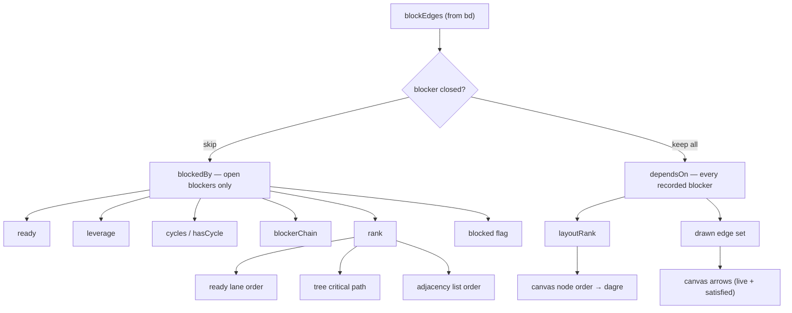

# fix: Keep epic graphs stable as work closes, and repaint done

## Summary

Stop the epic dependency graph from redrawing itself every time a bead closes. Closed blockers keep their arrows — drawn as satisfied rather than deleted — and layout derives from the full blocking history instead of only what is still open. Alongside that, the epic picker hides finished epics behind a toggle, and `closed` moves from grey to the epic's purple across every surface.

---

## Problem Frame

Watching an agent work through an epic, the picture will not hold still. `src/graph/BeadsGraph.ts:60` drops a blocking edge outright the moment its blocker closes:

```ts
for (const edge of blockEdges) {
  if (isClosed(edge.to)) continue;
```

The edge never reaches `blockedBy`, so the lens has nothing to draw and the arrow vanishes. Worse, `rank` is a longest-path computation over `blockedBy` (`src/graph/BeadsGraph.ts:69`), so closing one blocker shifts the rank of everything downstream, and dagre re-lays-out the whole subtree. The epic changes shape, not just loses arrows.

This was a deliberate call — `src/graph/lens.ts:31` records it as *"A closed blocker is not in the way, so it is not a line"* — and it is right about readiness and wrong about the picture. The two need separating.

Two smaller complaints ride along. The epic dropdown lists every epic forever, including ones finished months ago. And a finished bead goes grey, which reads as dead rather than done.

---

## Requirements

**Graph stability**

- R1. Closing a blocker leaves the epic's node positions and drawn edge set unchanged.
- R2. A dependency whose blocker has closed is drawn de-emphasized, visually distinct from both a live blocker and a containment tether.
- R3. Readiness, leverage, cycle warnings, and the blocker chain continue to count open blockers only.
- R4. The adjacency list's link count matches the number of links the canvas draws.

**Epic picker**

- R5. The epic dropdown lists only epics with at least one member still open, by default.
- R6. A "Show completed" toggle in the dropdown reveals the hidden epics and names how many are hidden.
- R7. The epic currently anchoring the lens stays listed after it completes, without the toggle.
- R8. An epic with no members is never treated as complete.

**Status palette**

- R9. Closed beads read purple on every surface — canvas, status badges, Kanban, details.
- R10. Pinned beads read yellow.
- R11. Every built-in status still resolves to a VS Code theme token that passes the existing contrast bar.

---

## Key Technical Decisions

- KTD1. **Split the blocking topology from the open blockers inside the derivation, not at the lens.** `blockedBy` currently conflates *what is recorded* with *what is still in the way*. Filtering at the lens would leave `rank` — and therefore layout — still keyed on open blockers, so the shape would keep shifting even with the arrows restored.

- KTD2. **Add `layoutRank` alongside `rank` rather than changing `rank`'s meaning.** `rank` has three consumers outside the canvas: the ready lane orders by it (`src/graph/readyLane.ts:173`), the tree picks its critical-path child by it (`src/graph/tree.ts:266`), and the adjacency list sorts by it (`src/webview/views/GraphView.tsx:64`). All three want the open-blocker meaning — "how deep is this in the remaining work" — and would be wrong on a structural rank.

- KTD3. **Structural rank needs its own stalled-node fallback.** `computeRanks` takes `inCycle` to rank nodes that never reach in-degree zero. That set is computed on the open graph. A cycle that a closed bead had broken is live again on the structural graph, so the Kahn walk stalls on nodes `inCycle` does not name and they keep rank 0 with no fixup — a wrong layout with no error. The structural pass must detect its own stalled nodes.

- KTD4. **Leverage, cycles, `blockerChain`, and the node-level `blocked` flag stay on the open graph.** On structural edges, a closed bead reports "unblocks 3" on its card, and the header warns about cycles that gate nothing.

- KTD5. **Move `closed` by editing `STATUS_HUE`, not by special-casing `readinessHue`.** One edit reaches the canvas (through `readinessHue`'s fallthrough), status badges, Kanban, and details at once. It also preserves the invariant `src/webview/theme/__tests__/tokens.test.ts:22` asserts — that `readinessHue(status, blocked)` equals `statusHue(status)` for every non-open status.

- KTD6. **Pinned takes `warning` (yellow).** Purple is the only text-safe token free for `closed`, and `accent` is what ties done to the epic card. Yellow is the one hue no status currently claims. Cost: on the canvas, yellow already tints open-but-blocked beads, so a pinned node resembles one — mitigated by the `blocked` text flag, which pinned nodes do not carry.

- KTD7. **Compute epic completeness in `listEpics`; filter in the toolbar.** `listEpics` already counts `closed`/`total` per epic. Adding a derived `complete` keeps the lens pure and leaves the "which are visible" decision — which depends on toggle state and the current anchor — in the component layer.

- KTD8. **Push UI branch logic into pure helpers.** This repo has no React render tests; the suites are pure-logic (`src/graph/`, `src/webview/theme/`, `src/webview/hooks/`). Any decision worth testing has to live outside JSX. This shapes U3, U4, and U5.

---

## High-Level Technical Design

One input edge list, two derived adjacencies, split by consumer. Directional guidance for the seam, not a specification of the implementation.



The left branch is today's behavior, unchanged. The right branch is new, and only the canvas consumes it.

---

## Implementation Units

### U1. Derive the structural blocking graph alongside the open one

- **Goal:** `BeadGraphNode` carries every recorded blocker and a rank that does not move when work closes, without disturbing the existing open-blocker fields.
- **Requirements:** R1, R3
- **Dependencies:** none
- **Files:**
  - `src/graph/types.ts`
  - `src/graph/BeadsGraph.ts`
  - `src/graph/__tests__/BeadsGraph.test.ts`
- **Approach:** Add `dependsOn: string[]` (every recorded blocker, closed or not) and `layoutRank: number` to `BeadGraphNode`. Build a second adjacency in the same loop that currently skips closed blockers, then run the existing longest-path pass over it. Both new fields are plain JSON, which the postMessage boundary requires (`src/graph/types.ts:4-7`). Leave `blockedBy`, `rank`, `ready`, `leverage`, `blockerChain`, `cycles`, and `childCounts` exactly as they are.
- **Execution note:** Write the layout-stability assertion (rank unchanged across a close) before the implementation — it is the requirement the whole plan turns on.
- **Patterns to follow:** The existing `blockedBy` / `blocksFor` pair construction in `deriveGraph`; mirror its shape rather than introducing a new abstraction.
- **Test scenarios:**
  - Given A blocks B and A is closed: `dependsOn` for B contains A, and `blockedBy` for B is empty.
  - Given the same fixture: `layoutRank` for B is 1 whether A is open or closed, while `rank` for B drops from 1 to 0 when A closes.
  - Given A blocks B, B blocks C, and A closes: `layoutRank` for C stays 2.
  - Given a closed A that blocks an open B: `leverage` for A is 0.
  - Given a cycle A → B → A where B is closed: `cycles` is empty and `hasCycle` is false, and both A and B still receive distinct non-default `layoutRank` values rather than stalling at 0.
  - Given B whose only blocker A has closed: `blockerChain` for B is empty and `ready` for B is true when B's status is open.
  - Given a blocker id outside the node set: it appears in both `dependsOn` and `blockedBy`, matching the existing "treat unknown as open" rule.
- **Verification:** The graph suite passes, and no assertion about `rank`, `ready`, `leverage`, or `cycles` needed changing — only additions.

### U2. Draw satisfied dependencies through the lens

- **Goal:** Every lens emits the full blocking edge set, each edge marked as live or satisfied, and orders nodes by the stable rank.
- **Requirements:** R1, R2, R3
- **Dependencies:** U1
- **Files:**
  - `src/graph/lens.ts`
  - `src/graph/__tests__/lens.test.ts`
- **Approach:** `LensEdge` gains `satisfied: boolean` on `kind: "blocks"` edges. `buildContext` builds its adjacency from `dependsOn`, including the coordination re-admission loop (`src/graph/lens.ts:280`) so a gate does not pop out of the picture when its edge is satisfied. The node-level `blocked` flag keeps reading `derived.blockedBy` so a bead with only satisfied blockers is not painted as waiting. Node ordering switches to `layoutRank`. Blast-radius traversal walks satisfied edges too, so that lens is stable for the same reason the epic lens is. Containment tethers are unaffected and never carry `satisfied`.
- **Patterns to follow:** The existing determinism contract in `finish` — fixed sort order for nodes and edges, because dagre output depends on insertion order.
- **Test scenarios:**
  - Given an epic whose member A blocks member B and A is closed: the epic lens emits the A → B edge with `satisfied` true.
  - Given the same fixture before and after A closes: the emitted node ids, their order, and the edge list are identical apart from the `satisfied` flag.
  - Given that fixture: `blocked` is false on B while the satisfied edge is present.
  - Given a coordination bead gating a visible bead through a satisfied edge: the coordination bead is still re-admitted and still marked `coordination`.
  - Given a full-lens graph with a parent-child pair: the containment tether keeps `kind: "contains"` and carries no `satisfied` flag.
  - Given a blast-radius focus reachable only through a satisfied edge: the far bead is still included, with its hop distance counted through that edge.
  - Given identical input applied twice: node order and edge order match exactly.
- **Verification:** The lens suite passes and the epic lens returns byte-identical node ordering before and after a member closes.

### U3. Render satisfied edges de-emphasized on the canvas

- **Goal:** A satisfied dependency reads as history at a glance — distinguishable from a live blocker, a cycle edge, and a containment tether.
- **Requirements:** R2
- **Dependencies:** U2
- **Files:**
  - `src/webview/views/edge-style.ts` (new)
  - `src/webview/views/__tests__/edge-style.test.ts` (new)
  - `src/webview/views/GraphCanvas.tsx`
  - `src/webview/styles/graph-canvas.css`
- **Approach:** Extract the current inline class / dash / marker ternaries (`src/webview/views/GraphCanvas.tsx:748-760`) into a pure `edgeStyle` helper and add the satisfied branch there. Three dash patterns are already in play — cycle at `5 4`, containment at `1 4`, live edges solid — so satisfied needs a fourth that is not confusable with them, plus reduced opacity. A satisfied edge keeps its arrowhead but needs a third `<marker>` with a muted fill, since the existing two hardcode neutral and warning fills.
- **Patterns to follow:** `src/webview/hooks/filter-state.ts` for the shape of a pure, separately-tested helper backing a component.
- **Test scenarios:**
  - Given a live blocking edge: `edgeStyle` returns the solid pattern and the standard arrow marker.
  - Given a satisfied blocking edge: it returns the satisfied class, a dash pattern distinct from both `5 4` and `1 4`, and the muted marker.
  - Given a satisfied edge that is also in a cycle: the cycle treatment wins, so a live cycle stays legible.
  - Given a containment tether: it returns the containment pattern and no arrow marker, whether or not `satisfied` is set.
  - Given a satisfied edge that is also dimmed by an active find: both classes are present.
- **Verification:** Opening an epic with completed members shows every historical arrow, visually recessed, with the live blockers still the most prominent lines on the canvas.

### U4. Reconcile the adjacency list's link count

- **Goal:** The header count and the canvas agree on how many links exist.
- **Requirements:** R4
- **Dependencies:** U1
- **Files:**
  - `src/graph/summary.ts`
  - `src/graph/__tests__/summary.test.ts`
  - `src/webview/views/GraphView.tsx`
- **Approach:** The count at `src/webview/views/GraphView.tsx:71` reduces over `blockedBy`, so once the canvas draws satisfied edges the header under-reports. Move the count into a pure helper in `src/graph/summary.ts` and have it report live and satisfied links separately, so the header can name both rather than picking one and being wrong about the other. The adjacency list body itself keeps listing open blockers under "blocked by" — that phrase is about what is in the way, and satisfied blockers are not.
- **Patterns to follow:** The existing derivation helpers in `src/graph/summary.ts`.
- **Test scenarios:**
  - Given a graph with two open blocking edges and one satisfied: the helper reports 2 live and 1 satisfied.
  - Given a graph with no blocking edges at all: both counts are 0.
  - Given a graph where every blocker has closed: live is 0 and satisfied equals the recorded edge count.
  - Given duplicate recorded blockers between the same pair: the pair is counted once.
- **Verification:** The header total matches the arrow count on the canvas for an epic mid-completion.

### U5. Hide completed epics behind a Show-completed toggle

- **Goal:** The epic picker defaults to work still in flight, without ever dropping the epic being watched.
- **Requirements:** R5, R6, R7, R8
- **Dependencies:** none (shares `src/graph/lens.ts` with U2; land after it to avoid a conflict)
- **Files:**
  - `src/graph/lens.ts`
  - `src/graph/__tests__/lens.test.ts`
  - `src/webview/common/GraphToolbar.tsx`
  - `src/webview/views/GraphCanvas.tsx`
  - `src/webview/styles/graph-canvas.css`
- **Approach:** `EpicOption` gains `complete: boolean`, set when the epic has at least one member and every member is closed — the epic's own status is not consulted, since a container's status says nothing about its contents. A pure `visibleEpics(epics, showCompleted, anchorId)` helper in `src/graph/lens.ts` applies the default filter and re-admits the anchored epic; the canvas owns the toggle state alongside its existing lens and filter state, and passes it down. `GraphToolbar` renders the toggle as a footer row in the existing `Dropdown`, using a custom control rather than a native checkbox per the project's no-native-controls rule.
- **Patterns to follow:** `GraphToolbar`'s existing stateless contract — the canvas owns all state, the toolbar only describes it. Use `DropdownItem` for the toggle row so it inherits keyboard and active-state behavior.
- **Test scenarios:**
  - Given an epic with three members, all closed: `complete` is true.
  - Given an epic with three members, two closed: `complete` is false.
  - Given an epic with no members: `complete` is false regardless of the epic's own status.
  - Given an epic whose own status is closed but which has an open member: `complete` is false.
  - Given a mixed list with the toggle off: `visibleEpics` returns only incomplete epics.
  - Given the toggle off and the anchored epic complete: the anchored epic is still returned, and still returned when it is the only epic left.
  - Given the toggle on: every epic is returned, in the original id order.
- **Verification:** With a finished epic anchored, the picker still names it; switching away removes it from the list unless the toggle is on, and the toggle names the hidden count.

### U6. Move closed to purple and pinned to yellow

- **Goal:** Done reads as arrival rather than absence, everywhere it appears.
- **Requirements:** R9, R10, R11
- **Dependencies:** none
- **Files:**
  - `src/webview/theme/tokens.ts`
  - `src/webview/theme/__tests__/tokens.test.ts`
  - `src/webview/theme/__tests__/contrast.test.ts`
  - `CHANGELOG.md`
- **Approach:** In `STATUS_HUE`, `closed` moves from `muted` to `accent` and `pinned` from `accent` to `warning`. Nothing else changes: `statusHue` feeds `StatusBadge`, `StatusPriorityPill`, and the `STATUS_COLORS` map, and `readinessHue` falls through to `statusHue` for every non-open status, so the canvas follows without a second edit. Update the `STATUS_HUE` doc comment, which currently explains the old assignments. Add a CHANGELOG entry under Unreleased per the repo convention.
- **Patterns to follow:** The token discipline in `src/webview/theme/tokens.ts` — hue lives in dots, icons, and borders; labels stay in text-safe tokens; no state is signalled by colour alone.
- **Test scenarios:**
  - `statusHue("closed")` returns the accent token and `statusHue("pinned")` returns the warning token.
  - `readinessHue("closed", true)` and `readinessHue("closed", false)` both equal `statusHue("closed")`, preserving the existing non-open invariant.
  - `readinessHue("open", false)` is still success and `readinessHue("open", true)` is still warning.
  - `closed` no longer shares a hue with `deferred`, and no longer shares one with `open`.
  - Every built-in status still resolves to a `var(--vscode-*)` reference, per the existing contrast assertion.
- **Verification:** The theme suites pass, and a closed bead shows the same purple as the epic goal card it belongs to.

---

## System-Wide Impact

The palette change is the widest-reaching part of this plan: `statusHue` backs the Issues list, Kanban board, details view, and the graph canvas, so a single token edit repaints all four. That is the intent, but it means U6 should be reviewed visually across surfaces rather than only by its unit tests.

The two new `BeadGraphNode` fields cross the extension/webview postMessage boundary. Both are plain JSON — a `string[]` and a `number` — which satisfies the constraint recorded at `src/graph/types.ts:4-7` that a `Map` arrives in the webview as an empty object.

---

## Risks & Dependencies

- **The structural-rank cycle stall is a silent failure.** If the guard in KTD3 is missed, affected nodes keep `layoutRank` 0 and dagre draws them in a column, with no error anywhere. The U1 cycle scenario is the specific test that catches it; do not drop it as an edge case.
- **Yellow carries two meanings on the canvas** once pinned moves — pinned status, and open-but-blocked. Accepted per KTD6, mitigated by the `blocked` text flag. If it reads badly in practice, moving pinned to blue alongside `hooked` is the fallback.
- **Long-running epics accumulate satisfied edges.** A hundred-bead epic finished to 90% draws ninety recessed arrows. The existing density resolver already governs how much the canvas will attempt, but the de-emphasis in U3 is what keeps this readable, so it is worth tuning against a real large epic rather than a fixture.
- **The palette edit is small but under-tested by construction.** `contrast.test.ts:177` asserts only that each status resolves to some `var(--vscode-*)` token, never which one, so it will stay green through a wrong assignment. `tokens.test.ts` is where the new hues have to be pinned explicitly.

---

## Scope Boundaries

**Deferred to follow-up work**

- Persisting the Show-completed toggle across VS Code restarts. It lives with the canvas's other session state for now.
- Tuning the density thresholds against large finished epics, once the satisfied-edge rendering exists to measure.

**Not in this plan**

- Changing what `bd ready` considers ready. Readiness semantics are untouched by design — that is the point of KTD4.
- Reworking how containment tethers are drawn.
- Caching node positions between renders. Considered and rejected: it stabilizes the picture by freezing it rather than by fixing the rank that moves, and drifts from the optimal layout as an epic grows.

---

## Deferred to Implementation

- Exact dash pattern and opacity for satisfied edges — needs looking at against real themes, not choosing from a fixture.
- Whether the fourth marker in U3 warrants its own token or can reuse an existing muted fill.
- The final helper name and home for `visibleEpics` if it turns out to fit better beside the existing filter helpers than in `src/graph/lens.ts`.

---

## Sources

- `src/graph/BeadsGraph.ts:60` — the edge-dropping line this plan splits apart.
- `src/graph/BeadsGraph.ts:216-254` — `computeRanks`, and the `inCycle` fallback that KTD3 cannot reuse structurally.
- `src/graph/BeadsGraph.ts:280-305` — `computeLeverage`, which must stay on the open graph.
- `src/graph/lens.ts:26-33` — the recorded rationale for deleting satisfied edges, superseded here for the picture but retained for readiness.
- `src/graph/lens.ts:179-200` — `listEpics`, which already computes the closed/total counts U5 builds on.
- `src/webview/theme/tokens.ts:1-86` — the token discipline and the measured contrast rationale behind which hues may carry meaning.
- `src/webview/views/GraphCanvas.tsx:727-770` — current edge rendering, including the two hardcoded arrow markers.
- `src/graph/readyLane.ts:173`, `src/graph/tree.ts:266` — the two out-of-canvas `rank` consumers that motivate KTD2.
